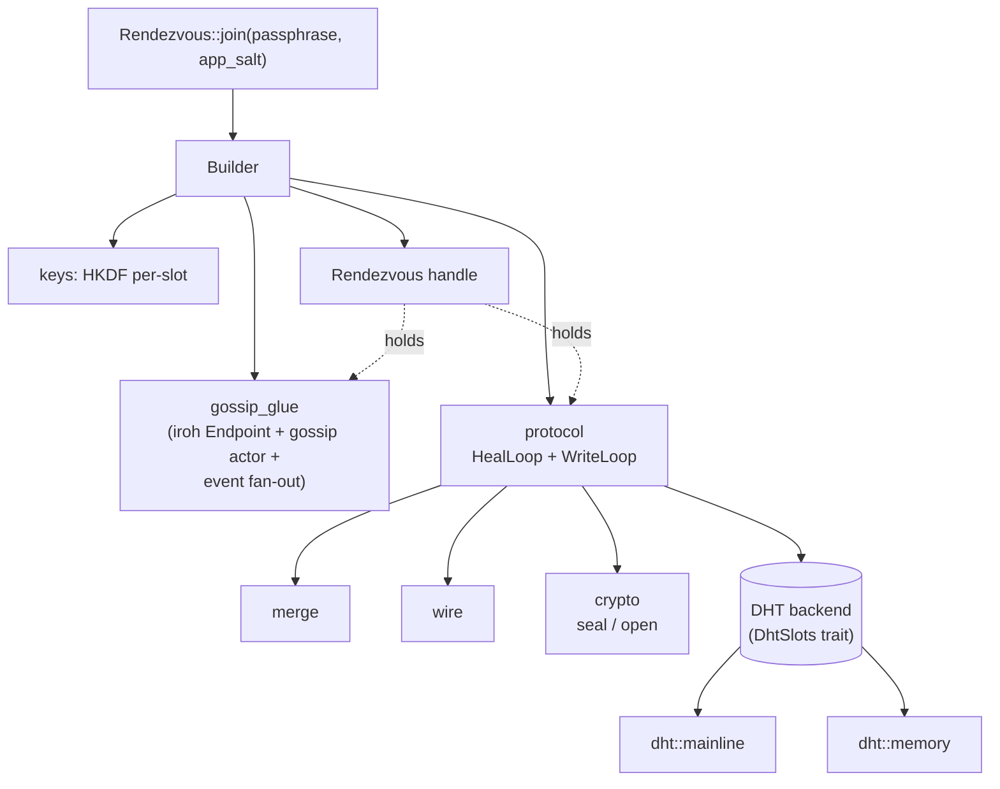

# Architecture

A map of where each piece of `iroh-gossip-rendezvous` lives. For the
algorithm itself see [`PROTOCOL.md`](PROTOCOL.md).

## Data flow



## Module responsibilities

| Module | Pure? | Async? | What it does |
|---|---|---|---|
| `keys` | ✓ | ✗ | HKDF-SHA256 derivation of topic id + per-slot Ed25519 keypairs + wrapper master keys |
| `wire` | ✓ | ✗ | Entry list `(id, age)` encode/decode, byte-budget checks |
| `crypto` | ✓ | ✗ | Two-layer AEAD (ChaCha20-Poly1305) with per-epoch wrapper ratchet |
| `merge` | ✓ | ✗ | Record merge: age-up, vouch, evict by max-age with random tie-break |
| `dht/mod` | ✓ | ✓ | `DhtSlots` trait + types (`SlotKey`, `SlotRecord`, `DhtError`) |
| `dht/memory` | ✓ | ✓ | In-memory `DhtSlots` — tests + simulator + `test-support` |
| `dht/mainline` | — | ✓ | Production `DhtSlots` over the public Mainline DHT (BEP 44) |
| `protocol` | — | ✓ | `initial_join`, `spawn_loops` (HealLoop + WriteLoop), `ProtoState`, `GossipView` trait |
| `gossip_glue` | — | ✓ | iroh `Endpoint` build, gossip subscription, `Event` fan-out via `tokio::broadcast` |
| `rendezvous` | — | ✓ | Public `Rendezvous` handle; owns the `JoinSet` of background tasks and the `CancellationToken` |
| `builder` | — | ✓ | Public `Builder` with parameter validation + defaults (§2 of PROTOCOL.md) |
| `state` | ✓ | ✗ | Observable `RendezvousState` + `DhtStatus` enum |
| `error` | ✓ | ✗ | `thiserror` Error enum |
| `sim_impl` | — | ✓ | Discrete-event simulator (feature-gated `sim`); re-exported as `crate::sim` |

"Pure" = no I/O, no tokio, Miri-compatible.

## Lifetime invariants

- `Rendezvous` is the **keep-alive anchor**. It owns the `CancellationToken`
  and the `JoinSet` of all background tasks. Drop it, and the DHT
  maintenance loops cancel.
- Any `GossipSender` or `broadcast::Receiver<Event>` extracted from a
  `Rendezvous` must be used only while the `Rendezvous` is alive. After
  drop, the internal event fan-out task terminates and new subscribers
  receive `RecvError::Closed`.
- The iroh `Endpoint` is closed during `Rendezvous::shutdown`. Callers who
  need the endpoint past that point should construct it themselves and
  inject it via `Builder::endpoint`.

## Background tasks

Started by `Builder::build`, stored in two `JoinSet<()>`s inside
`Rendezvous`:

1. **Gossip** (`gossip_glue::build`):
   - `spawn_accept_loop` — handles incoming iroh connections for the
     gossip ALPN.
   - `spawn_event_task` — drains the iroh-gossip `GossipReceiver`,
     updates the `RendezvousState.neighbor_count`, and broadcasts every
     `Event` to caller-side subscribers.
2. **Protocol** (`protocol::spawn_loops`):
   - HealLoop — every `T_h · jitter`, read `s = max(1, K − |N|)` random
     slots and hand discovered peer IDs to `GossipView::join_peers`.
   - WriteLoop — first iteration publishes immediately (completes §5 Join
     from the spec); thereafter sleeps `T_w · jitter` and writes with
     probability `1/(|N|+1)`.

Both loops cancel on `Rendezvous::shutdown` or on drop.

## DHT abstraction

```rust
#[async_trait]
trait DhtSlots: Send + Sync + 'static {
    async fn read(&self, slot: SlotKey) -> Result<Option<SlotRecord>, DhtError>;
    async fn write(&self, slot: SlotKey, record: SlotRecord) -> Result<(), DhtError>;
}
```

Two impls:

- `dht::mainline::MainlineDht` — BEP 44 puts/gets over the public Mainline
  DHT via the [`mainline`] crate. Re-signs via `MutableItem::new` so
  signatures match the BEP 44 canonical form remote nodes verify against.
- `dht::memory::InMemoryDht` — process-local `HashMap<SlotKey, SlotRecord>`,
  signature-verifying, LWW at equal seq. Used by tests, simulator, and the
  `test-support` feature's `Builder::dht_backend` injection.

The trait is `pub(crate)` by default; the `sim` feature exposes it publicly
for third-party DHT backends.

[`mainline`]: https://docs.rs/mainline

## Feature flags

See [README](README.md#features) for the user-facing table. Implementation
notes:

- `sim` exposes `crate::sim::*` from `sim_impl`; re-exports `InMemoryDht`,
  `DhtSlots`, `ProtoState`, and merge/wire helpers.
- `kani` adds `#[kani::proof]` functions to `src/kani_proofs.rs` (invisible
  to regular builds).
- `miri-compat` adds `#[cfg_attr(miri, ignore)]` on tests that touch tokio
  I/O or real DHT.
- `mainline-live` enables live-network integration tests, run only in the
  nightly CI lane.
- `test-support` (implies `sim`) adds `Builder::dht_backend(Arc<dyn DhtSlots>)`
  so integration tests can run multi-node scenarios against `InMemoryDht`
  without a real DHT.
